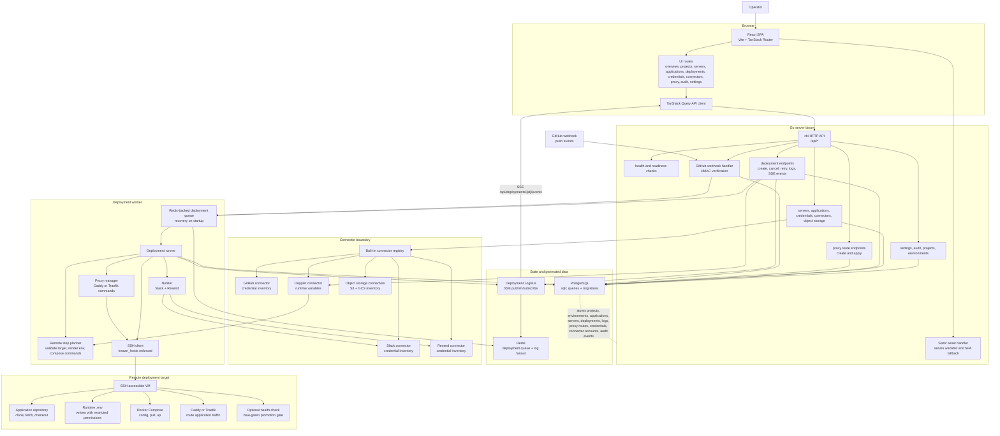

# Deploy Manager

Deploy Manager is a slim internal control plane for remote server management and Docker Compose deployments.

It registers SSH-accessible servers, validates connectivity, monitors resource health, deploys application stacks, manages Caddy or Traefik proxy routes, streams deployment logs, and keeps an inventory of credentials with permission and usage visibility. It does not manage secret values directly; systems such as Doppler are integrated through connectors.

## Stack

- Go backend with chi, sqlc, PostgreSQL, Redis, SSH, Docker SDK, and SSE log streaming.
- React + TypeScript frontend built with Vite, Tailwind CSS v4, TanStack Query, TanStack Router, and Zustand.
- Docker Compose for local development.
- Single production image with the Go server serving built frontend assets.

## Architecture

This Mermaid diagram is intentionally kept in the README so it is easy to move, edit, and render directly in GitHub.



Primary request flow:

1. The React SPA calls `/api/*` endpoints on the Go server.
2. API handlers validate input, persist state through sqlc/PostgreSQL, and enqueue deployment work in Redis when needed.
3. The deployment worker recovers queued/interrupted work on startup, pops Redis jobs, loads the target from PostgreSQL, syncs Doppler runtime variables, and executes a validated remote Docker Compose plan over SSH.
4. Deployment output is stored in PostgreSQL, published through Redis-backed `LogBus`, and streamed to the UI over Server-Sent Events.
5. Connectors keep credential, permission, usage, runtime variable, and object-storage inventory behind explicit provider boundaries; Deploy Manager stores references and metadata, not private secret values.

## Local Development

```bash
docker compose -f docker-compose.dev.yml up --build
```

The app listens on `http://localhost:8080` by default.

For local frontend/backend iteration outside Compose:

```bash
npm install
npm run dev
go run ./cmd/server
```

Set `DATABASE_URL` and `REDIS_URL` when running the Go server directly.

## Verification

```bash
if command -v sqlc >/dev/null 2>&1; then sqlc generate; else $(go env GOPATH)/bin/sqlc generate; fi
GOFLAGS=-mod=mod go test ./...
GOFLAGS=-mod=mod go build ./cmd/server
npm test
npm run lint
npm run build
docker compose config --quiet
docker compose -f docker-compose.dev.yml config --quiet
git diff --check
docker build --progress=plain -t deploy-manager:verify .
```
