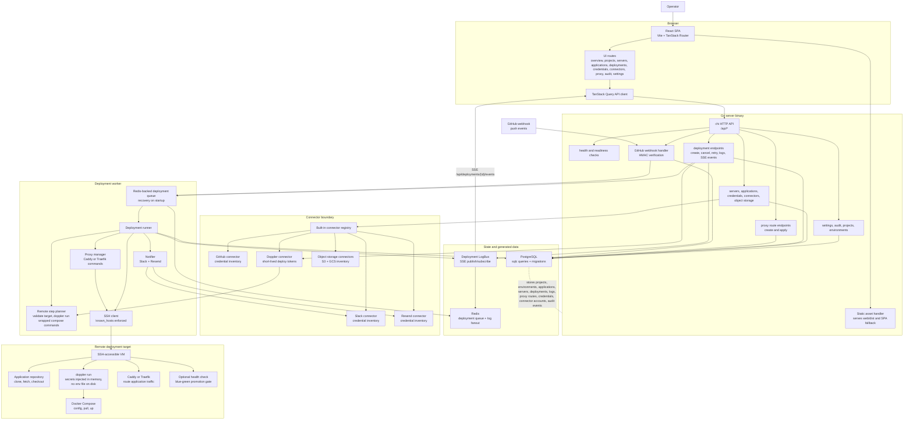

# Deploy Manager

Deploy Manager is a slim internal control plane for remote server management and Docker Compose deployments.

It registers SSH-accessible servers, validates connectivity, monitors resource health, deploys application stacks, manages Caddy or Traefik proxy routes, streams deployment logs, and keeps an inventory of credentials with permission and usage visibility. It does not manage secret values directly; systems such as Doppler are integrated through connectors.

## Stack

- Go backend with chi, sqlc, PostgreSQL, Redis, SSH, Docker SDK, and SSE log streaming.
- React + TypeScript frontend built with Vite, Tailwind CSS v4, TanStack Query, TanStack Router, and Zustand.
- Docker Compose for local development.
- Single production image with the Go server serving built frontend assets.

## Architecture

This Mermaid diagram is intentionally kept in the README so it is easy to move, edit, and render directly in GitHub.



Primary request flow:

1. The React SPA calls `/api/*` endpoints on the Go server.
2. API handlers validate input, persist state through sqlc/PostgreSQL, and enqueue deployment work in Redis when needed.
3. The deployment worker recovers queued/interrupted work on startup, pops Redis jobs, loads the target from PostgreSQL, mints a short-lived read-only Doppler service token for the application's project/config, and executes a validated remote Docker Compose plan over SSH with every compose command wrapped in `doppler run`.
4. Deployment output is stored in PostgreSQL, published through Redis-backed `LogBus`, and streamed to the UI over Server-Sent Events.
5. Connectors keep credential, permission, usage, runtime variable, and object-storage inventory behind explicit provider boundaries; Deploy Manager stores references and metadata, not private secret values.

## Runtime Environment (Doppler-only)

Runtime env is injected exclusively through Doppler at deploy time. No env
file ever exists on a deployment target and there is no alternative env path:

- Every application must be mapped to a Doppler project/config; deployments fail without it.
- The control plane never downloads secret values. Per deployment it mints a short-lived (30m), read-only service token scoped to that one config.
- The token reaches the target over SSH stdin only — never argv, never a file — and `doppler run --no-fallback` injects secrets straight into the compose process memory.
- A guard step removes legacy `.env` files and rejects compose files that use `env_file:`.

See `docs/doppler-runtime-env.md` for the full flow and threat model.

## GitHub and Builds

GitHub integration is intentionally split into three layers:

1. **Repository access**: GitHub connector config stores repository metadata such as `owner/repo`, branch, and optional GitHub App installation ID. It must not store app private keys, OAuth secrets, webhook secrets, deploy keys, or tokens.
2. **Push sync**: GitHub sends signed `push` events to `/api/webhooks/github`. Deploy Manager verifies `X-Hub-Signature-256` and matches the pushed repository and branch to applications with `github_auto_deploy=true`.
3. **Image builds**: build execution stays behind a provider boundary. When a matching GitHub connector owns the repository, Deploy Manager dispatches a GitHub Actions workflow through the GitHub App installation token. The workflow owns Docker build/push and reports an `image_ref` back for deployment. Apps without a matching connector can still fall back to source-build-on-target from their repository and Compose path.

GitHub App repository sync requires server-side GitHub App credentials only. Set the app id and private key through the runtime environment or a private key file path. The database stores the installation id and repository metadata, not GitHub tokens or private keys. Repository build dispatch defaults to the workflow file `deploy-manager-build.yml` on the connected branch.

Each connected repository can also carry build metadata:

```json
{
  "repository": "prosights/recreate",
  "branch": "main",
  "workflow_id": "deploy-manager-build.yml",
  "build_context": ".",
  "dockerfile": "Dockerfile",
  "image_ref": "us-docker.pkg.dev/prosights/recreate/recreate:main",
  "runner": "ubuntu-latest"
}
```

When a build is dispatched, Deploy Manager creates a `build_runs` row, passes `deploy_manager_build_id` plus the repository build metadata into GitHub Actions, and waits for the workflow to call `POST /api/builds/{buildID}/complete` with the pushed image reference. A successful callback matches applications by `repository_url` and branch, then queues blue/green deployments with that `image_ref`. The callback is protected by the normal API auth header in production; keep `DEPLOY_MANAGER_API_TOKEN` as a GitHub Actions secret, not in Deploy Manager connector config.

To connect two repositories, add both repositories to a GitHub connector with their installation id, branch, workflow file, image ref, build context, Dockerfile, and runner. Then create or update the applications for those repos with the same branch and `github_auto_deploy=true`.

For Google Artifact Registry, copy `docs/workflows/deploy-manager-build-gar.yml` into each application repo as `.github/workflows/deploy-manager-build.yml`. Configure the repo with:

- GitHub variables: `DEPLOY_MANAGER_API_URL`, `GAR_REGISTRY_HOST`
- GitHub secrets: `DEPLOY_MANAGER_API_TOKEN`, `GCP_WORKLOAD_IDENTITY_PROVIDER`, `GCP_SERVICE_ACCOUNT`

The workflow uses GitHub OIDC to obtain a short-lived Google token and push to Artifact Registry. Do not add service-account JSON, registry passwords, or GitHub tokens to Deploy Manager.

For GHCR, copy `examples/deploy-manager-build.yml` instead. Configure GitHub variables `REGISTRY_HOST=ghcr.io` and `DEPLOY_MANAGER_API_URL`, configure GitHub secret `DEPLOY_MANAGER_API_TOKEN`, and set the connector `image_ref` to the exact GHCR image tag Deploy Manager should deploy.

## Self-Deploying Deploy Manager

Deploy Manager deploys itself through the same GitHub build and blue/green
deployment loop as application services. The production lane is:

```text
push to main -> GitHub App webhook -> workflow_dispatch -> Docker image
-> /api/builds/{id}/complete -> blue/green deploy on internal
-> Caddy upstream flip -> rollback slot recorded
```

Use `.github/workflows/deploy-manager-build.yml` for this repository. For
`main` builds, configure the GitHub connector image ref as an immutable template
such as:

```text
REGISTRY_HOST/NAMESPACE/REPOSITORY/deploy-manager:main-${SHORT_SHA}
```

The workflow also pushes `main`, `main-<short-sha>`, and `sha-<short-sha>`.
Pushing a Git tag like `v1.2.3` publishes that version tag when the GitHub repo
variable `DEPLOY_MANAGER_IMAGE` is set to the image name without a tag. Version
tag pushes are for release bookkeeping and rollback reference; automatic
production deployment stays on `main`.

On the `internal` VM, keep PostgreSQL and Redis outside the color swap and run
only the app container through Deploy Manager. The bootstrap files and exact
application/proxy settings live in `ops/self-deploy/`.

For the first build provider, prefer one of these two paths:

- **GitHub larger runners** for the fastest first integration when repositories already live in GitHub. GitHub bills larger runners only while jobs execute, with no charge for an idle larger runner, and publishes Linux larger runner sizes from 4 to 96 cores.
- **Google Cloud Build high-CPU** when pushing to Google Artifact Registry is the priority. Cloud Build publishes on-demand high-CPU build machines such as 8 vCPU and 32 vCPU builders with per-minute pricing.

See `docs/build-provider-decision.md` for the current build-provider recommendation.

Keep the build-provider choice out of projects. Projects should reference applications, repositories, environments, registries, and VM targets; a separate build connector/provider should create an image, push it to the configured registry, then queue a deployment with `image_ref`.

## Local Development

```bash
docker compose -f docker-compose.dev.yml up --build
```

The app listens on `http://localhost:8080` by default.

For local frontend/backend iteration outside Compose:

```bash
npm install
npm run dev
go run ./cmd/server
```

Set `DATABASE_URL` and `REDIS_URL` when running the Go server directly.

## Verification

```bash
if command -v sqlc >/dev/null 2>&1; then sqlc generate; else $(go env GOPATH)/bin/sqlc generate; fi
GOFLAGS=-mod=mod go test ./...
GOFLAGS=-mod=mod go build ./cmd/server
npm test
npm run lint
npm run build
docker compose config --quiet
docker compose -f docker-compose.dev.yml config --quiet
git diff --check
docker build --progress=plain -t deploy-manager:verify .
```
